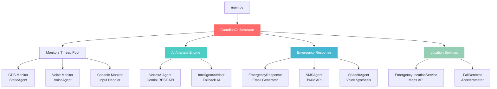

# 🛡️ GuardianNav
> **Agent de sécurité personnelle basé sur IA**  
> Système avancé de surveillance et d'assistance d'urgence utilisant l'intelligence artificielle, la géolocalisation et les communications multi-canaux pour assurer votre sécurité en temps réel.

[](https://python.org)
[](https://cloud.google.com/vertex-ai)
[](https://twilio.com)
[](LICENSE)

## 📋 Table des matières
- [🎯 Vue d'ensemble](#-vue-densemble)
- [🏗️ Architecture du système](#️-architecture-du-système)
- [📁 Structure des fichiers](#-structure-des-fichiers)
- [🔄 Workflow principal](#-workflow-principal)
- [🤖 Agents et composants](#-agents-et-composants)
- [⚡ Scénarios d'urgence](#-scénarios-durgence)
- [🚀 Installation et configuration](#-installation-et-configuration)
- [💡 Utilisation](#-utilisation)
- [🔧 Configuration avancée](#-configuration-avancée)

## 🎯 Vue d'ensemble

GuardianNav est un système de sécurité personnelle intelligent qui combine :
- **🧠 Intelligence Artificielle** (Vertex AI Gemini) pour l'analyse des situations d'urgence
- **📍 Géolocalisation GPS** en temps réel
- **📱 Notifications multi-canaux** (Email + SMS)
- **🎤 Reconnaissance vocale** et **🔊 Synthèse vocale**
- **🤖 Détection automatique de chutes**
- **🏥 Localisation des services d'urgence** à proximité

### ✨ Fonctionnalités clés
- ✅ **Surveillance continue** : GPS, accéléromètre, commandes vocales
- ✅ **Détection intelligente d'anomalies** : chutes, immobilité prolongée, déviations de trajet
- ✅ **Analyse IA avancée** : évaluation du niveau d'urgence et conseils personnalisés
- ✅ **Notifications automatiques** : contacts d'urgence via email et SMS
- ✅ **Localisation des secours** : hôpitaux, transports, services d'urgence à proximité
- ✅ **Interface vocal** : commandes et feedback en français
- ✅ **Escalade automatique** : intervention progressive selon la gravité

---

## 🏗️ Architecture du système



### 🔄 Flux de données principal
1. **Surveillance** → Les monitors détectent les événements (GPS, voix, chute)
2. **Analyse** → L'IA évalue la situation et le niveau d'urgence  
3. **Décision** → L'orchestrateur choisit la réponse appropriée
4. **Action** → Notifications, synthèse vocale, localisation des secours
5. **Escalade** → Intensification automatique si nécessaire

---

## 📁 Structure des fichiers

### 🗂️ Organisation du projet
```
GuardianNav/
├── 📄 main.py                          # Point d'entrée principal
├── 📄 setup.py                         # Installation et dépendances
├── 📄 requirements.txt                 # Packages Python requis
├── 📄 api_keys.yaml                    # Configuration des clés API (privé)
├── 📄 README.md                        # Documentation complète
├── 📄 LICENSE                          # Licence MIT
│
├── 📁 guardian/                        # 🧠 Cœur du système
│   ├── 📄 __init__.py                  
│   ├── 🎯 guardian_agent.py            # Orchestrateur principal
│   ├── 🤖 vertex_ai_agent_rest.py     # Agent IA Vertex AI (REST API)
│   ├── 📍 GPS_agent.py                 # Surveillance GPS et localisation
│   ├── 🎤 voice_agent.py               # Reconnaissance vocale
│   ├── 🔊 speech_agent.py              # Synthèse vocale
│   ├── 📱 sms_agent.py                 # Notifications SMS (Twilio)
│   ├── 📧 emergency_response.py        # Générateur d'emails d'urgence
│   ├── 🏥 emergency_locations.py       # Services d'urgence à proximité
│   ├── 🤸 fall_detector.py             # Détecteur de chutes
│   ├── 🧠 intelligent_advisor.py       # IA de fallback et conseils
│   ├── 🚨 wrongpath_agent.py          # Détection de déviations
│   └── ⚙️ config.py                   # Configuration système
│
├── 📁 tests/                          # 🧪 Tests unitaires
│   ├── 📄 test_static_agent.py        
│   └── 📄 test_voice_agent.py         
│
├── 📁 vosk-model-small-fr-0.22/       # 🎤 Modèle de reconnaissance vocale
└── 📁 venv311/                        # 🐍 Environnement virtuel Python
```

### 📝 Description des fichiers principaux

#### 🎯 `guardian_agent.py` - Orchestrateur principal
**Rôle** : Cerveau central du système coordonnant tous les agents
```python
class GuardianOrchestrator:
    def __init__(self, config):
        # Initialise tous les agents spécialisés
        # Charge la configuration depuis api_keys.yaml
        
    def handle_alert(self, trigger_type, position):
        # Gère le workflow d'urgence principal
        # Analyse -> Réponse utilisateur -> Action
        
    def handle_fall_detection(self, fall_info):
        # Workflow spécialisé pour les chutes
        
    def _trigger_emergency_assistance_with_vertex_ai(self, reason, analysis):
        # Déclenche l'assistance avec analyse IA avancée
```

**Fonctions principales** :
- `handle_alert()` : Workflow principal d'alerte
- `handle_fall_detection()` : Gestion spécialisée des chutes
- `_trigger_emergency_assistance()` : Déclenchement des secours
- `_send_emergency_notifications()` : Envoi email + SMS
- `_handle_vertex_ai_*_emergency()` : Gestion par niveau d'urgence

#### 🤖 `vertex_ai_agent_rest.py` - Intelligence artificielle
**Rôle** : Analyse avancée des situations d'urgence avec Gemini
```python
class VertexAIAgent:
    def analyze_emergency_situation(self, context, location, user_input):
        # Analyse contextuelle de la situation d'urgence
        # Retourne niveau d'urgence (1-10) et conseils
        
    def analyze_fall_emergency(self, fall_info, user_response):
        # Analyse spécialisée pour les chutes
        
    def _make_api_request(self, prompt, max_tokens):
        # Communication avec l'API Gemini
```

**Capacités** :
- 🎯 **Évaluation du niveau d'urgence** (1-10)
- 🏥 **Conseils médicaux spécialisés** selon la situation
- 🚨 **Classification automatique** des types d'urgence
- 🌍 **Intégration What3Words** pour localisation précise
- 🔄 **Mode simulation** si API indisponible

#### 📱 `sms_agent.py` - Notifications SMS
**Rôle** : Envoi de SMS d'urgence via Twilio
```python
class SMSAgent:
    def send_emergency_sms(self, contacts, emergency_context):
        # Envoie SMS personnalisés aux contacts d'urgence
        
    def _generate_emergency_sms_message(self, contact, context):
        # Génère message SMS contextuel et personnel
```

**Fonctionnalités** :
- 📲 **Messages personnalisés** par contact (famille, ami, médecin)
- 📍 **Localisation automatique** avec adresse et What3Words
- ⚡ **Envoi immédiat** avec gestion d'erreurs
- 🔄 **Retry automatique** en cas d'échec

#### 📧 `emergency_response.py` - Générateur d'emails
**Rôle** : Création et envoi d'emails d'urgence visuels
```python
class EmergencyResponse:
    def send_location_to_contacts(self, position, reason):
        # Email standard avec carte et informations
        
    def send_critical_alert(self, position, reason):
        # Email d'urgence critique avec priorité maximale
        
    def send_fall_emergency_alert(self, position, fall_info):
        # Email spécialisé pour les chutes avec contexte médical
```

**Types d'emails** :
- 🗺️ **Email avec carte interactive** (Google Maps)
- 🏥 **Informations médicales d'urgence** contextuelles  
- 📱 **Liens directs** pour appeler les secours
- 🎨 **Design responsive** optimisé mobile

#### 🎤 `voice_agent.py` & 🔊 `speech_agent.py` - Interface vocale
**Reconnaissance vocale (voice_agent.py)** :
```python
class VoiceAgent:
    def listen_for_commands(self):
        # Écoute continue des commandes vocales
        
    def process_voice_command(self, text):
        # Traite et interprète les commandes
```

**Synthèse vocale (speech_agent.py)** :
```python
class SpeechAgent:
    def speak_alert(self, alert_type, message):
        # Synthèse vocale d'alertes
        
    def speak_emergency_instructions(self, instructions):
        # Instructions vocales d'urgence
```

#### 📍 `GPS_agent.py` - Surveillance géolocalisation
**Rôle** : Monitoring GPS et détection d'anomalies
```python
class StaticAgent:
    def get_coordinates(self):
        # Récupère position GPS actuelle
        
    def detect_movement_anomaly(self, positions):
        # Détecte immobilité ou déviations
```

#### 🤸 `fall_detector.py` - Détection de chutes
**Rôle** : Analyse des données d'accéléromètre
```python
class FallDetector:
    def analyze_movement_data(self, acceleration_data):
        # Détecte chutes par analyse des accélérations
        
    def classify_fall_severity(self, impact_force):
        # Évalue la gravité de la chute
```

**Détection** :
- 📊 **Seuils de décélération** configurables (-8 m/s²)
- ⏱️ **Immobilité prolongée** après impact (30s)
- 🎯 **Classification automatique** : légère/modérée/grave
- 🚨 **Déclenchement progressif** selon la gravité

#### 🏥 `emergency_locations.py` - Services d'urgence
**Rôle** : Localisation des services d'urgence à proximité
```python
class EmergencyLocationService:
    def find_emergency_refuges(self, position, radius_m):
        # Trouve hôpitaux, pharmacies à proximité
        
    def find_emergency_transport(self, position, radius_m):
        # Localise transports publics d'urgence
```

## ⚡ Scénarios d'urgence

### 🚨 Scénario 1 : Détection de chute

**Déclencheur** : Accéléromètre détecte décélération > -8 m/s²

```
1. 📱 Capteur → Chute détectée (impact fort)
2. ⏰ Countdown → 30 secondes pour répondre
3. 🔊 Synthèse vocale → "Chute détectée ! Répondez !"
4. 🎤 Attente réponse utilisateur...

┌─ ✅ "Je vais bien"
│   └── 📝 Log incident + surveillance renforcée
│
├─ 🚨 "Besoin d'aide" 
│   └── 🤖 Vertex AI → Analyse spécialisée chute
│       ├── Force impact : ÉLEVÉE
│       ├── Mobilité post-chute : LIMITÉE  
│       ├── Niveau urgence : 8/10 (Élevée)
│       └── 🚑 Déclenchement secours médicaux
│
└─ ❌ Aucune réponse (30s)
    └── ⚠️ Vérification mouvement...
        ├── Mouvement OK → Chute avec mobilité (niveau 7)
        └── Immobile → 🆘 URGENCE MAXIMALE (niveau 10)
```

**Actions automatiques** :
- 📧 **Email urgent** avec carte et infos médicales
- 📱 **SMS personnalisés** à tous les contacts
- 🏥 **Localisation hôpitaux** dans un rayon de 2km
- 🔊 **Instructions vocales** premiers secours
- 📍 **Partage What3Words** pour localisation précise

### 🔴 Scénario 2 : Situation dangereuse

**Déclencheur** : Utilisateur dit "Au secours" ou "Danger"

```
1. 🎤 Reconnaissance vocale → Mot-clé d'urgence détecté
2. 🔊 Question immédiate → "Êtes-vous en sécurité ?"
3. 🎤 Réponse utilisateur...

┌─ ✅ "Oui, fausse alerte"
│   └── 📝 Log + surveillance normale
│
├─ 🚨 "Non" ou description situation
│   └── 🤖 Vertex AI → Analyse contextuelle
│       ├── Mots-clés : "agression", "menace", "poursuite"
│       ├── Contexte : Lieu + heure + historique
│       ├── Niveau urgence : 9/10 (Critique)
│       └── 🚔 Alerte sécurité immédiate
│
└─ ❌ Aucune réponse (30s)
    └── 🆘 DÉCLENCHEMENT AUTOMATIQUE
```

**Réponse spécialisée sécurité** :
- 🚔 **Police automatiquement prévenue** (17)
- 📍 **Géolocalisation continue** transmise
- 🏃 **Refuges sûrs à proximité** (commissariats, lieux publics)
- 🚇 **Transports d'urgence** pour s'éloigner
- 📞 **Appel automatique** contacts prioritaires

### 🟡 Scénario 3 : Malaise médical

**Déclencheur** : "Je ne me sens pas bien" ou immobilité prolongée

```
1. 📍 GPS → Immobilité détectée > 5 minutes (lieu inhabituel)
2. 🔊 Vérification → "Tout va bien ? Bougez ou répondez"
3. ⏰ Attente 60 secondes...
4. 🎤 Réponse ou mouvement...

┌─ ✅ Mouvement détecté
│   └── 📝 Surveillance normale reprise
│
├─ 🚨 "Malaise" / "Douleur"
│   └── 🤖 Vertex AI → Analyse médicale
│       ├── Symptômes décrits
│       ├── Localisation + accessibilité
│       ├── Niveau urgence : 6/10 (Modérée)
│       └── 🚑 Assistance médicale
│
└─ ❌ Aucune réponse + immobilité continue
    └── 📈 Escalade progressive
        ├── +2 min → SMS contacts famille
        ├── +5 min → Email détaillé + carte
        └── +10 min → 🆘 Appel secours
```

### 🔵 Scénario 4 : Déviation de trajet

**Déclencheur** : GPS sort de la zone prévue sans raison

```
1. 📍 WrongPathAgent → Déviation > 500m du trajet habituel
2. 🔊 Question préventive → "Votre trajet a changé, tout va bien ?"
3. 🎤 Réponse...

┌─ ✅ "Oui, changement volontaire"
│   └── 📝 Nouveau trajet enregistré
│
├─ 🚨 "Non" ou "Perdu(e)"
│   └── 🗺️ Assistance navigation
│       ├── Instructions GPS vocales
│       ├── Refuges sûrs à proximité
│       └── Contacts prévenus (niveau 3/10)
│
└─ ❌ Aucune réponse
    └── 📊 Analyse contextuelle
        ├── Heure (nuit = +urgence)
        ├── Lieu (zone risquée = +urgence) 
        ├── Historique déplacements
        └── 📱 Alerte préventive contacts
```

---

## 🚀 Installation et configuration

### 📋 Prérequis système

```bash
# Système d'exploitation
- Windows 10/11, macOS 10.15+, ou Linux Ubuntu 18.04+
- Python 3.8 ou supérieur
- Connexion Internet stable
- Microphone et haut-parleurs (interface vocale)
- GPS/localisation activée
```

### ⚡ Installation rapide

1. **Cloner le repository** :
```bash
git clone https://github.com/organicanna/GuardianNav.git
cd GuardianNav
```

2. **Créer l'environnement virtuel** :
```bash
python -m venv venv311
# Windows
venv311\Scripts\activate
# macOS/Linux  
source venv311/bin/activate
```

3. **Installer les dépendances** :
```bash
pip install -r requirements.txt
```

4. **Télécharger le modèle vocal français** :
```bash
# Le modèle Vosk français est déjà inclus dans le repo
# Sinon télécharger depuis : https://alphacephei.com/vosk/models
```

### 🔧 Configuration des clés API

Créer le fichier `api_keys.yaml` (copier depuis le template) :

```yaml
# Configuration Google Cloud APIs
google_cloud:
  project_id: "votre-projet-gcp"
  vertex_ai:
    enabled: true
    region: "europe-west1"
    api_key: "VOTRE_CLE_VERTEX_AI"
  services:
    maps_api_key: "VOTRE_CLE_GOOGLE_MAPS"
    text_to_speech_api_key: "VOTRE_CLE_TTS"

# Notifications SMS Twilio
notification_services:
  twilio:
    account_sid: "VOTRE_TWILIO_SID"
    auth_token: "VOTRE_TWILIO_TOKEN"
    phone_number: "+33123456789"  # Votre numéro Twilio

# Contacts d'urgence
emergency_contacts:
  - name: "Contact Famille"
    phone: "+33612345678"
    email: "famille@example.com"
    relation: "famille"
    
  - name: "Contact Médecin"
    phone: "+33987654321"
    email: "medecin@example.com"
    relation: "médecin"

# Configuration email
email:
  enabled: true
  smtp_server: "smtp.gmail.com" 
  smtp_port: 587
  from_email: "votre.email@gmail.com"
  password: "VOTRE_MOT_DE_PASSE_APP"
```

### 🔑 Obtention des clés API

#### 🤖 **Vertex AI (Google Cloud)** :
1. Aller sur [Google Cloud Console](https://console.cloud.google.com)
2. Créer/sélectionner un projet
3. Activer l'API Vertex AI
4. Générer une clé API dans "APIs & Services > Credentials"

#### 📱 **Twilio SMS** :
1. Créer un compte sur [Twilio](https://twilio.com)
2. Obtenir Account SID et Auth Token depuis le dashboard
3. Acheter un numéro de téléphone Twilio

#### 🗺️ **Google Maps** :
1. Activer Maps JavaScript API dans Google Cloud Console
2. Générer une clé API avec restrictions géographiques
3. Activer la facturation (usage gratuit jusqu'à certaines limites)

#### 🔊 **Google Text-to-Speech** :
1. Activer Cloud Text-to-Speech API
2. Utiliser la même clé que pour Maps ou créer une clé dédiée

---

## 💡 Utilisation

### 🚀 Démarrage du système

```bash
# Activer l'environnement virtuel
source venv311/bin/activate  # macOS/Linux
# ou
venv311\Scripts\activate     # Windows

# Lancer GuardianNav
python main.py
```

**Interface de démarrage** :
```
==================================================
GuardianNav - Agent de sécurité personnelle
==================================================
🛡️ Initialisation des agents...
✅ GPS Agent - Prêt
✅ Voice Agent - Prêt (Modèle français chargé)
✅ Vertex AI Agent - Connecté (Mode: Production/Simulation)
✅ SMS Agent - Configuré (Twilio)
✅ Speech Agent - Prêt (Synthèse vocale)
✅ Emergency Response - Configuré

🎯 Surveillance active démarrée
📍 Position GPS: 48.8566, 2.3522 (Paris, France)
🎤 Interface vocale: EN ÉCOUTE

Commandes disponibles:
- "test urgence" : Test du système complet
- "ma position" : Affiche la position actuelle  
- "aide" : Liste des commandes
- Ctrl+C : Arrêt du système
```

### 🎤 Commandes vocales

```python
# Urgences
"Au secours"         → Déclenchement d'urgence immédiat
"Aide moi"           → Assistance d'urgence  
"Je suis en danger"  → Alerte sécurité critique
"Appelle les secours" → Contact services d'urgence

# Informations  
"Où suis-je ?"      → Position GPS actuelle
"Ma position"       → Coordonnées + adresse
"Hôpital le plus proche" → Services médicaux à proximité

# Tests et configuration
"Test urgence"      → Test complet du système
"Test sms"          → Test notifications SMS
"Test email"        → Test notifications email  
"Silence"           → Mode silencieux temporaire
```

### ⌨️ Commandes console

```python
# Tests système
test_emergency      # Test complet workflow d'urgence
test_fall          # Simulation chute
test_sms           # Test SMS Twilio
test_vertex        # Test connexion Vertex AI

# Informations
position           # GPS actuel + adresse
status             # État tous les agents
contacts           # Liste contacts d'urgence
config             # Configuration système

# Simulation urgences
simulate_danger    # Simulation danger immédiat
simulate_malaise   # Simulation malaise médical  
simulate_lost      # Simulation perte/déviation

# Contrôle
stop               # Arrêt système
restart            # Redémarrage agents
help               # Aide complète
```

### 📱 Notifications reçues

#### SMS famille (exemple) :
```
🚨 URGENCE - Votre proche a besoin d'aide!

📍 Localisation: 123 Rue de Rivoli, Paris
🎯 What3Words: exemple.mots.location
⏰ Heure: 15:45
🏥 Urgence médicale (niveau 7/10)

🚑 Secours prévenus
📞 Gardez votre téléphone allumé
🗺️ Localisation en temps réel partagée

--- GuardianNav Emergency System ---
```

#### Email détaillé (extrait) :
```html
🚨 ALERTE URGENCE GuardianNav 🚨

Type: Chute détectée avec blessure potentielle
Niveau: 8/10 (ÉLEVÉE)
Heure: 29/10/2024 - 15:45:32

📍 LOCALISATION:
[Carte Google Maps interactive]
Adresse: 123 Rue de Rivoli, 75001 Paris
What3Words: exemple.mots.location

🏥 SERVICES D'URGENCE À PROXIMITÉ:
• Hôpital Saint-Antoine (650m) ☎️ 01.49.28.20.00
• Pharmacie Lafayette (200m) - Ouverte 24h/24
• Commissariat 1er (400m) ☎️ 17

📱 ACTIONS IMMÉDIATES:
[Appeler SAMU 15] [Naviguer vers lui] [L'appeler]

🧠 ANALYSE IA: 
Chute détectée avec impact modéré. Personne consciente mais 
potentiel traumatisme. Surveillance médicale recommandée.
```

## 🔧 Configuration avancée

### ⚙️ Paramètres du détecteur de chute

```yaml
# Dans guardian_agent.py - FallDetector configuration
fall_detector_config:
  speed_threshold_high: 15.0    # km/h - Vitesse élevée (vélo/course)
  speed_threshold_low: 2.0      # km/h - Quasi-immobile
  acceleration_threshold: -8.0   # m/s² - Décélération critique
  stationary_time: 30.0        # secondes - Immobilité = urgence
  
  # Seuils de classification
  impact_light: -5.0           # m/s² - Chute légère  
  impact_moderate: -8.0        # m/s² - Chute modérée
  impact_severe: -12.0         # m/s² - Chute grave
```

### 🎤 Configuration reconnaissance vocale

```python
# Modèle Vosk - Français
voice_config:
  model_path: "vosk-model-small-fr-0.22"
  sample_rate: 16000
  language: "fr-FR"
  
  # Mots-clés d'urgence (personnalisables)
  emergency_keywords: [
    "au secours", "aide", "urgence", "danger", 
    "secours", "police", "samu", "pompiers",
    "mal", "douleur", "chute", "blessé"
  ]
  
  # Seuil de confiance
  confidence_threshold: 0.6    # 60% minimum
```

### 📧 Templates d'emails personnalisés

```python
# Dans emergency_response.py
email_templates:
  
  # Template chute  
  fall_template: |
    🚨 ALERTE CHUTE - {user_name}
    
    📊 ANALYSE SITUATION:
    • Type: {fall_type}
    • Gravité: {severity}
    • Impact: {impact_force} m/s²
    • Mobilité post-chute: {mobility_status}
    
    📍 LOCALISATION PRÉCISE:
    {google_maps_embed}
    
    🏥 AIDE MÉDICALE IMMÉDIATE:
    {nearest_hospitals}
    
  # Template danger
  danger_template: |
    🔴 URGENCE SÉCURITÉ - {user_name}
    
    ⚠️ SITUATION: {danger_type}
    📊 Niveau critique: {urgency_level}/10
    
    🚔 REFUGES SÉCURISÉS:
    {safe_locations}
```

---

## 📄 Licence

MIT License - voir [LICENSE](LICENSE) pour détails.

---

## 🆘 Support et contact

- 📧 **Email** : support@guardiannav.com  
- 🐛 **Bugs** : [GitHub Issues](https://github.com/organicanna/GuardianNav/issues)
- 📖 **Documentation** : [Wiki GitHub](https://github.com/organicanna/GuardianNav/wiki)
- 💬 **Discussions** : [GitHub Discussions](https://github.com/organicanna/GuardianNav/discussions)

---

## 🙏 Remerciements

- **Google Cloud Vertex AI** - Intelligence artificielle avancée
- **Twilio** - Infrastructure SMS fiable  
- **Vosk** - Reconnaissance vocale offline
- **OpenStreetMap** - Données géographiques ouvertes
- **Contributeurs** - Communauté open source active

---

> **🛡️ GuardianNav - Votre sécurité, notre priorité**  
> *Développé avec ❤️ pour protéger ce qui compte le plus*

---
